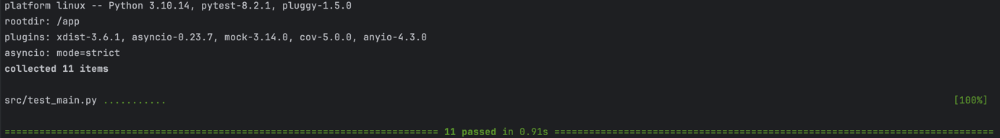

## Tech Chalenge #1
Repositório com objetivo de atender aos requisitos propostos no projeto integrador do curso de Machine Learning Engineering da instituição FIAP.

## Tecnologias utilizadas
- Python
- FastAPI
- Swagger
- Docker
- Github Actions
- AWS ECR
- AWS Lambda
- AWS ApiGateway

## Requisitos
- Docker
- Docker Compose

## Deploy
A cada alteração realizada na branch `Master` a pipeline de deploy será acionada, enviando as alterações para o serviço Lambda Serveless, conforme diagrama:


## Comandos
Utilize os comandos abaixo para executar as ações desejadas:

**Iniciar aplicação localmente**

```bash
docker-compose up -d
```

**Instalar depêndencias do projeto**

```bash
docker-compose exec web pip install -r ./requirements/requirements.txt
```


**Limpar cache**

```bash
rm -rf __pycache__
```
## Autenticação
Para obter o token de autenticação, utilize o endpoint `/login` com o query param `password`, contendo o valor: `SenhaFixa`

Demais EndPoints exigem uso de autenticação via HTTP Bearer Token. 
Utilize o token obtido no endpoint `/login` para consumir a API

## Documentação
Com o projeto rodando localmente, basta acessar o link para consultar a documentação do projeto:
http://localhost:8000/docs

# Testes
Para executar os testes de integração, execute o seguinte comando:
```bash
 docker-compose exec web pytest
```

O resultado esperado é semelhante ao apresentado abaixo:



****

## Agenda evolutiva do projeto:
- [x] Endpoint GET /producao
- [x] Endpoint GET /comercializacao
- [x] Endpoint GET /importacao
- [x] Endpoint GET /exportacao
- [x] Continuous Deploy
- [x] Acrescentar Payloads de Response na Documentação do Swagger
- [x] Endpoint GET /processamento ***(Necessário corrigir "parseamento" do payload de response)***
- [x] URL pública para API (AWS Lambda + ApiGateway)
- [x] Implementar Método de Autenticação (JWT)
- [x] Testes de integração